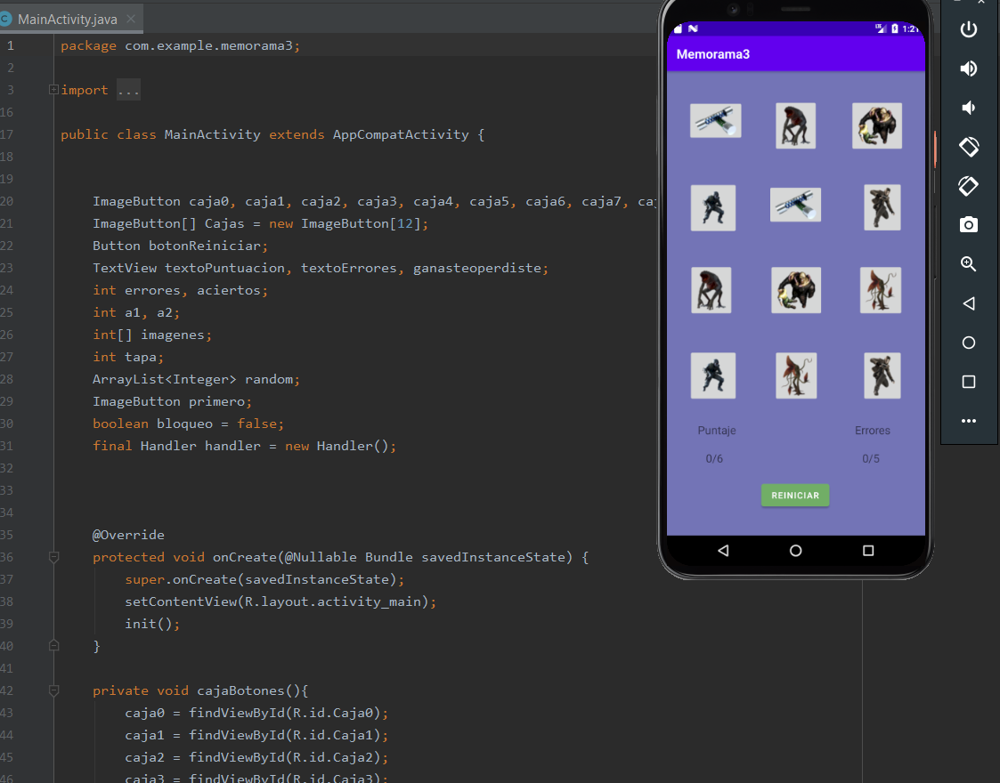

# Memorama en Android con Java
## Juego de memoria en Java

Lenguaje: Java

En el presente proyecto, se realizo un juego por medio del lenguaje java denominado memorama, con tematica del videojuego Resident Evil

